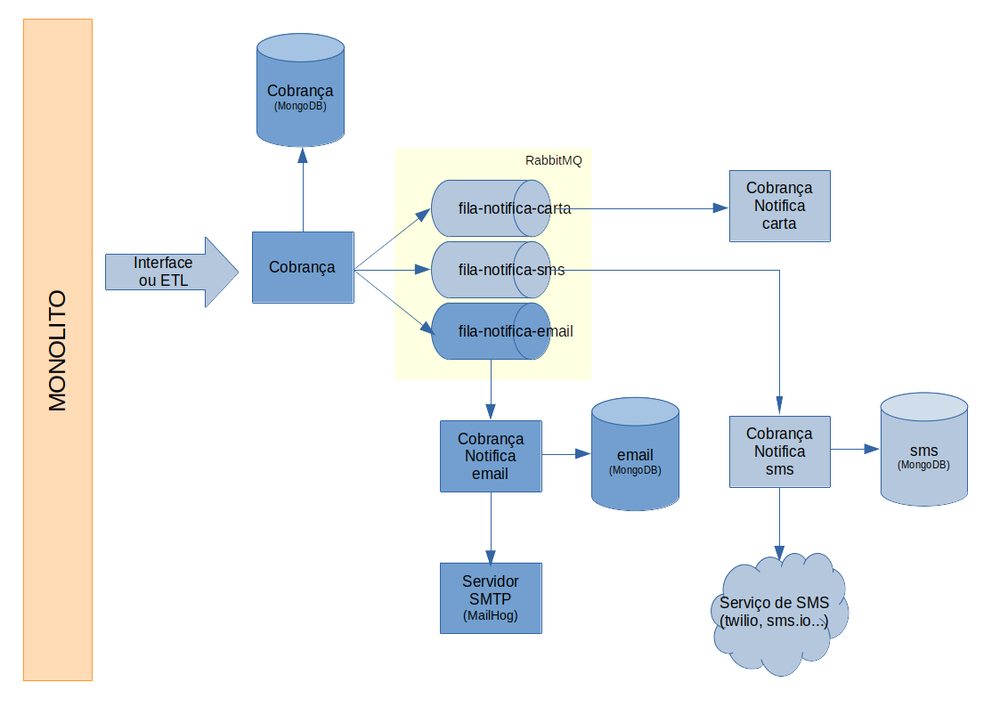
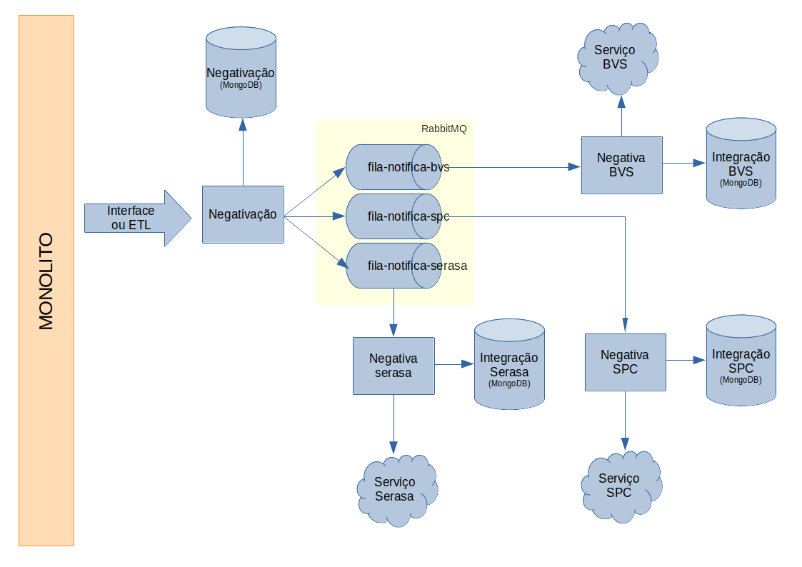

# itau-cobranca

A idéia desse projeto é propor uma solução de [módulos](#módulos) que tenham funções bem específicas e possam trabalhar de forma assíncrona e que sejam escaláveis.

Para facilitar a apresentação, os dois módulos implementados nessa POC estão contidos nesse mesmo repositório git.


## Requisitos para execução do projeto localmente

[Docker] e [docker compose] serão usados no decorrer da documentação para subir toda a infra estrutura necessária para executar o projeto localmente.

O comando abaixo irá iniciar todos os containers necessários para o desenvolvimento local da solução.

```bash
docker-compose -f docker-compose-dev.yml up
```

Este comando poderá demorar um pouco para rodar, pois irá subir todos os containers de bancos de dados, rabbitmq e irá compilar e gerar as imagens docker dos projetos de `cobrança` e `notificação de cobrança por email`

```bash
docker-compose up
```

O comando acima irá iniciar os containers com os seguintes serviços: [Mongodb], [RabbitMq] e [MailHog].


## Endereços locais

* swagger modulo de cobrança: http://localhost:9102/swagger-ui.html
* swagger modulo de notificação de cobrança por email: http://localhost:9103/swagger-ui.html
* mongo-express: http://localhost:8081/
* painel do rabbitmq: http://localhost:8080/
* painel do MailHog: http://localhost:8025/

## Tecnologias usadas para o projeto

### Framework

Todos os módulos criados neste projeto foram desenvolvidos com [Spring]

### rabbitmq

Sistema de fila usado para distribuir as informações de forma que as aplicações fiquem desacopladas e possam escalar horizontalmente

### MailHog

Servidor fake de emails usado para teste.
Possui uma interface web para consultar o que foi enviado, e a configuração da aplicação da aplicação java é exatamente a mesma de um servidor smtp real, facilitando os testes e o deploy da aplicação em ambiente de produção ou homologação.

### MongoDb

Durante a inicialização do projeto com `docker-compose up`, será disparado junto com a primeira inicialização do banco de dados o arquivo `docker/mongo-init.js`.

Neste arquivo, serão criados os usuários e bancos necessários para executar a aplicação localmente.

# Módulos

## itau-cobranca

Este projeto é uma interface REST que recebe as informações de cobrança de um determinado cliente, grava em forma de documento dentro de um banco de dados (MongoDB) e e publica uma mensagem em diversas filas (RabbitMq) para que sejam notificados diversos canais de forma assíncrona: email, sms, carta, telefone, whatsapp.

## itau-cobranca-notify-email

Este projeto ouve a fila `queue.notifica.cobranca.email`, obtém os dados de cobrança, aplica um template de mensagem e envia o texto para o servidor SMTP configurado no profile do spring.

# Diagramas

## Cobrança



## Negativação




[Spring]: https://spring.io/
[Docker]: https://docs.docker.com/get-docker/
[docker compose]: https://docs.docker.com/compose/install/
[Mongodb]: https://www.mongodb.com/pt-br
[RabbitMq]: https://www.rabbitmq.com/
[MailHog]: https://github.com/mailhog/MailHog